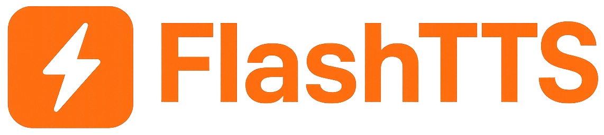

<div align="center">
  

[📘 Documentation](docs/en/README.MD)

[中文](README.MD) | [English](README_EN.MD)

</div>

---

# FlashTTS

> Powered by state-of-the-art models such as **SparkTTS, OrpheusTTS, MegaTTS 3**, FlashTTS delivers high-quality
> Mandarin speech synthesis and zero-shot voice cloning. With a clean and intuitive Web interface, you can quickly
> generate natural, lifelike voices for dubbing, narration, accessibility, virtual characters, and more.

> If you find FlashTTS helpful, please leave us a ⭐ Star!

## ✨ Highlights

|     | Feature                        | Description                                                                                    |
|-----|--------------------------------|------------------------------------------------------------------------------------------------|
| 🚀  | **Multi-backend Acceleration** | Supports high-performance inference engines like `vllm`, `sglang`, `llama-cpp`, `mlx-lm`, etc. |
| 🎯  | **High Concurrency**           | Dynamic batching and asynchronous queues to handle heavy traffic with ease                     |
| 🎛️ | **Full Parameter Control**     | Adjust pitch, speaking rate, temperature, emotion tags, and more                               |
| 📱  | **Lightweight Deployment**     | Built on FastAPI—start with a single command; minimal dependencies                             |
| 🔊  | **Long-form Synthesis**        | Supports very long texts while maintaining consistent voice quality                            |
| 🔄  | **Streaming TTS**              | Generate and play audio in real time; reduces wait time, enhances interactivity                |
| 🎭  | **Multi-character Dialog**     | Synthesize multiple roles within the same text—ideal for script dubbing                        |
| 🎨  | **Modern Frontend**            | Web-ready, responsive interface                                                                |

## 🖼️ Frontend Demo

https://github.com/user-attachments/assets/1bd9d586-fac7-4016-b955-5a58d8fb9d7e

## 🔈 Voice Samples

Below are demos showcasing FlashTTS’s cloning capabilities across different models and characters.

### SparkTTS Model

<table>
<tr>
<td align="center">

**Donald Trump (EN)**  
[Listen](https://github.com/user-attachments/assets/79d4d1d1-5579-4ddb-8092-500b3db05d45)

</td>
<td align="center">

**Donald Trump (ZH)**  
[Listen](https://github.com/user-attachments/assets/262f4306-4a0f-4735-b4e7-708cd3193324)

</td>
</tr>
<tr>
<td align="center">

**Nezha**  
[Listen](https://github.com/user-attachments/assets/4743778b-63c7-4c42-95b2-636828364d67)

</td>
<td align="center">

**Li Jing**  
[Listen](https://github.com/user-attachments/assets/b5a51fa9-c5a1-4f39-bbf8-09e73b2c1936)

</td>
</tr>
<tr>
<td align="center">

**Yu Chengdong**  
[Listen](https://github.com/user-attachments/assets/1cd5f156-010d-4bc9-8e99-f37def54b99f)

</td>
<td align="center">

**Xu Zhisheng**  
[Listen](https://github.com/user-attachments/assets/f197ac39-5928-4ead-83d7-071b1bf5f974)

</td>
</tr>
</table>

### MegaTTS 3 Model

<table>
<tr>
<td align="center">

**Cai Xukun**  
[Listen](https://github.com/user-attachments/assets/bcb48ead-f157-45d7-8060-cbccf418f0ed)

</td>
<td align="center">

**Taiyi Zhenren**  
[Listen](https://github.com/user-attachments/assets/73edbd6b-ece3-4e22-95a2-53b7c4e45346)

</td>
</tr>
</table>

### OrpheusTTS (ZH) Model

<table>
<tr>
<td align="center">

**Changle**  
[Listen](https://github.com/user-attachments/assets/271bd5a3-dd56-430a-87d0-ebea0e397a89)

</td>
<td align="center">

**Baizhi**  
[Listen](https://github.com/user-attachments/assets/e012c580-840f-401c-99f5-665c72f6b89f)

</td>
</tr>
</table>

## Quick Start

It is recommended to install `flashtts` in a **Python 3.8–3.12** environment via pip:

```bash
pip install flashtts
```

For detailed installation steps, please refer to: [installation guide](docs/zh/get_started/installation.md)

Local inference command:：
```bash
flashtts infer \
  -i "hello world." \
  -o output.wav \
  -m ./models/your_model \
  -b vllm \
  [other optional parameters]
```

For detailed usage，please refer to: [quick_start.md](docs/en/get_started/quick_start.md)

Server deployment:

```bash
 flashtts serve \
 --model_path Spark-TTS-0.5B \ 
 --backend vllm \ 
 --role_dir data/roles \
 --llm_device cuda \
 --tokenizer_device cuda \
 --detokenizer_device cuda \
 --wav2vec_attn_implementation sdpa \
 --llm_attn_implementation sdpa \ 
 --torch_dtype "bfloat16" \ 
 --max_length 32768 \
 --llm_gpu_memory_utilization 0.6 \
 --host 0.0.0.0 \
 --port 8000
 ```

## ⚡ Inference Speed

Test environment: `A800 GPU` · Model: `Spark-TTS-0.5B` · Test script: [speed_test.py](examples/speed_test.py)

| Scenario |  Engine   | Device | Audio Length (s) | Inference Time (s) | RTF  |
|:--------:|:---------:|:------:|:----------------:|:------------------:|:----:|
|  Short   | llama-cpp |  CPU   |       7.48       |        6.81        | 0.91 |
|  Short   |   torch   |  GPU   |       7.18       |        7.68        | 1.07 |
|  Short   |   vllm    |  GPU   |       7.24       |        1.66        | 0.23 |
|  Short   |  sglang   |  GPU   |       7.58       |        1.07        | 0.14 |
|   Long   | llama-cpp |  CPU   |      121.98      |       117.83       | 0.97 |
|   Long   |   torch   |  GPU   |      113.70      |       107.17       | 0.94 |
|   Long   |   vllm    |  GPU   |      111.82      |        7.28        | 0.07 |
|   Long   |  sglang   |  GPU   |      117.02      |        4.20        | 0.04 |

> **RTF < 1** means real-time synthesis.

## ⚙️ Usage Tips

1. **SparkTTS** weights must be `bfloat16` or `float32`; using `float16` will cause errors.
2. If you experience long silent gaps, try increasing `repetition_penalty` (> 1.0).
3. **OrpheusTTS** supports inserting `<tag>` in text to control emotion. See `LANG_MAP` in [
   `orpheus_engine.py`](flashtts/engine/orpheus_engine.py).
4. For safety reasons, **MegaTTS 3** does not publish the WaveVAE encoder. Please follow the official instructions to
   download it: [reference audio](https://drive.google.com/drive/folders/1QhcHWcy20JfqWjgqZX1YM3I6i9u4oNlr).

## 🤝 Acknowledgments

- [Spark-TTS](https://github.com/SparkAudio/Spark-TTS)
- [Orpheus-TTS](https://github.com/canopyai/Orpheus-TTS)
- [MegaTTS 3](https://github.com/bytedance/MegaTTS3)

## ⚠️ Disclaimer

FlashTTS is provided for academic research, education, and lawful purposes only, such as accessibility assistance and
personalized speech synthesis. Do **not** use it for fraud, impersonation, deepfakes, or other illegal activities. Users
are responsible for any misuse.

## License

This project follows the same license as Spark-TTS.
See [LICENSE](https://github.com/SparkAudio/Spark-TTS/blob/main/LICENSE) for details.

## Star History

[](https://www.star-history.com/#HuiResearch/FlashTTS&Date)